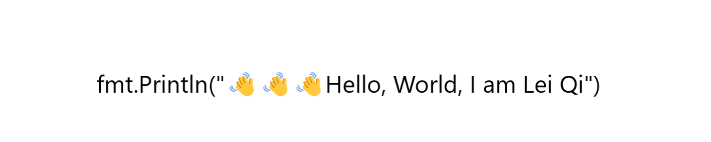

    

Welcome to my space! My  Visitor.

## About Me  
- 🌱 Fudan University.

- ⭐ Huawei Software Development Engineer.
<picture>
  <source media="(prefers-color-scheme: dark)" srcset="https://raw.githubusercontent.com/leiqichn/leiqichn/output/github-contribution-grid-snake-dark.svg">
  <source media="(prefers-color-scheme: light)" srcset="https://raw.githubusercontent.com/leiqichn/leiqichn//output/github-contribution-grid-snake.svg">
  
</picture>

## Interest 👨🏽‍💻
- Project : NLP, Large Language Model, Golang Project, Python Project, Vue Project.

- Language : Golang, Python, C++/C, Java, Vue, Django.

## Open Source Experience 👯

**As a manager** ：

- [优酷x天池 「酷文」小说创作大模型挑战赛](https://tianchi.aliyun.com/competition/entrance/532210/customize509): DeepThinking Team Leader, **Third Prize**.

**As a member** :

* [PhenoBERT](https://github.com/TianlabTech/PhenoBERT.git) : **PhenoBERT:** A combined deep learning method for automated recognition of human phenotype ontology

- [IEEE Journal of Biomedical and Health Informatics（IF=5.77）]() : Reviewer

## Competition

- [优酷x天池 「酷文」小说创作大模型挑战赛](https://tianchi.aliyun.com/competition/entrance/532210/customize509): DeepThinking Team Leader, **Third Prize**.

## GitHub Stats 📫

  
  

